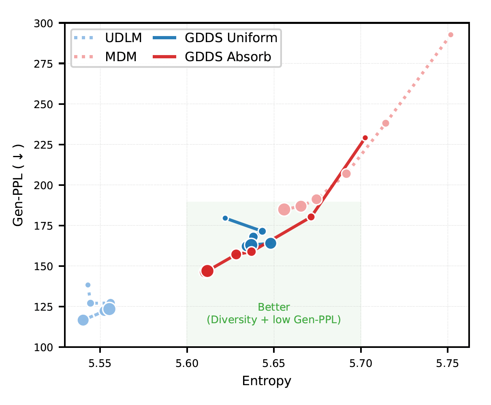
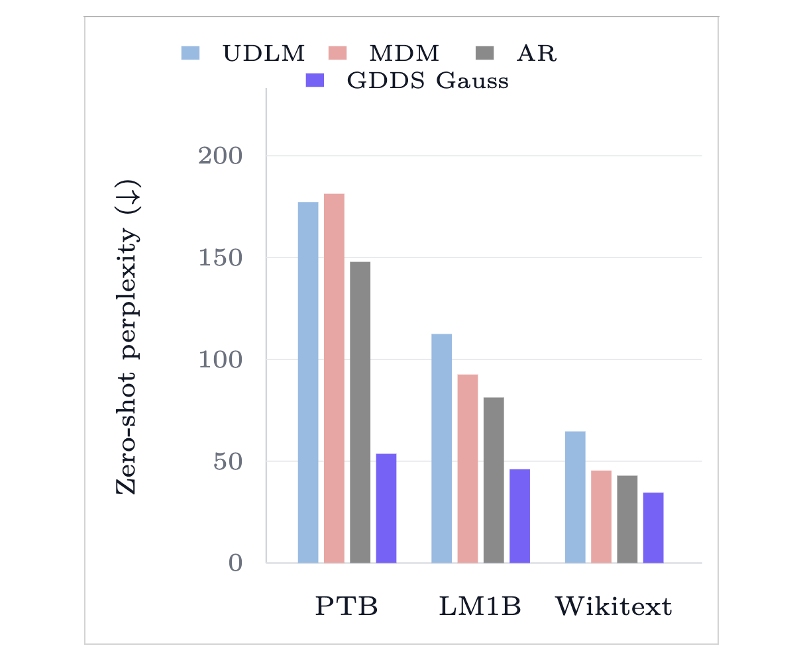
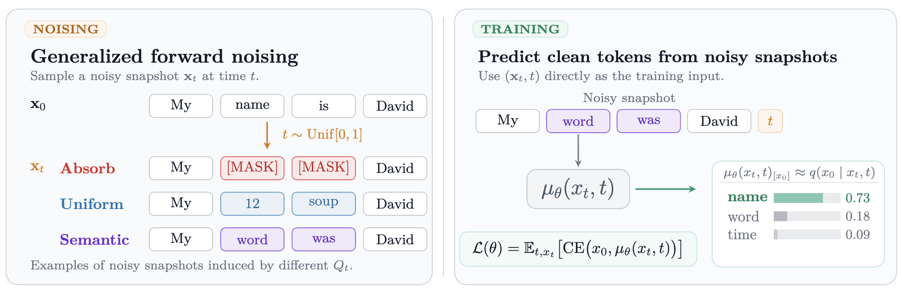

# Generalized Discrete Diffusion from Snapshots (GDDS)

[](https://arxiv.org/abs/2603.21342)
[](https://github.com/ozekri/gdds)
[](https://oussamazekri.fr/gdds)
[](https://huggingface.co/papers/2603.21342)

Official implementation of the paper **"Generalized Discrete Diffusion from Snapshots"**.

[Oussama Zekri](https://oussamazekri.fr/), [Théo Uscidda](mailto:theo.uscidda@ensae.fr), [Nicolas Boullé](https://nboulle.github.io/), [Anna Korba](https://akorba.github.io/)

[](assets/videos/gdds_forward_noising_teaser.gif)

GDDS is a modular codebase for discrete diffusion modeling over large discrete state spaces. This release includes the GDDS training and sampling pipeline, baseline discrete diffusion algorithms, and Semantic-Informed Kernel (SIK) forward processes with both KNN and KeOps backends.

<table>
  <tr>
    <td width="50%">
      
    </td>
    <td width="50%">
      
    </td>
  </tr>
</table>

## Why GDDS?



- Supports arbitrary noising processes in discrete state spaces.
- Trains with a snapshot-based objective rather than the full noising trajectory.
- Includes practical samplers and forward-process variants used in the paper.
- Ships as a Hydra-based research codebase that is easy to configure and extend.

## What’s inside this codebase?

- GDDS training code and baseline algorithms.
- SIK forward processes with both KNN and KeOps backends.
- Campbell-style snapshot baselines for uniform and absorbing noising.
- Sampling and evaluation utilities.
- Hydra configs for datasets, models, samplers, schedulers, and execution strategy.

## Installation

The package requires Python `>=3.9`. A Python 3.11 environment is a good default:

```bash
conda create -n gdds python=3.11
conda activate gdds
pip install -r requirements.txt
pip install -e .
```

This installs the project as the `gdds` Python distribution and exposes the `gdds` CLI entrypoint.

Minimal verification:

```bash
python -c "import discrete_diffusion; print('ok')"
```

`flash-attn` is optional. The default repository codepaths do not require it.

For high-throughput training on A100/H100 GPUs, you can install it separately:

```bash
pip install flash-attn --no-build-isolation
```

## Quickstart

The package exposes a Hydra-based CLI through either `python -m discrete_diffusion` or the installed `gdds` entrypoint.

Minimal training example:

```bash
python -m discrete_diffusion \
  data=openwebtext \
  algo=gdds \
  model=small \
  noise=log-linear \
  forward_process=gdds_gauss \
  sampling=gdds_sik
```

Equivalent installed entrypoint:

```bash
gdds \
  data=openwebtext \
  algo=gdds \
  model=small \
  noise=log-linear \
  forward_process=gdds_gauss \
  sampling=gdds_sik
```

Minimal sampling example:

```bash
python -m discrete_diffusion \
  data=openwebtext \
  algo=gdds \
  model=small \
  noise=log-linear \
  forward_process=gdds_gauss \
  sampling=gdds_sik \
  mode=sample \
  sampling.sampler.num_steps=1024
```

## Common Workflows

### Choose a Forward Process

The release includes both SIK backends:

```bash
forward_process=sik_knn
```

and

```bash
forward_process=sik_keops
```

The GDDS sampler path in this release uses the KNN route.

### Switch Algorithms

Available algorithm configs include:

- `algo=gdds`
- `algo=campbell`
- `algo=mdlm`
- `algo=udlm`
- `algo=ar`

### Run Evaluation

Evaluation-related configs live under `configs/eval/`, including:

- `eval=gen_ppl`
- `eval=generate_samples`

### Inspect the CLI

```bash
python -m discrete_diffusion --help
```

## Data, Caches, and Outputs

Dataset cache roots default to:

```bash
$HOME/.cache/gdds
```

You can override that globally with:

```bash
export GDDS_DATA_DIR=/path/to/your/cache/root
```

or by editing:

```bash
configs/paths/local.yaml
```

and setting:

```yaml
cache_root: /path/to/your/cache/root
```

By default, Hydra writes run directories under:

```bash
outputs/<dataset>/<YYYY.MM.DD>/<HHMMSS>
```

The default checkpoint callbacks write inside the run directory under:

```bash
dummy_checkpoints/checkpoints/
```

Generated samples default to:

```bash
samples.json
```

within the active Hydra run directory.

## Runtime Notes

- The default configs target CUDA execution through Lightning.
- GPU training is the primary supported path for this release.
- KeOps is included as a dependency because some forward-process configurations use it.
- `flash-attn` improves throughput on supported hardware but is not required.

## Repository Structure

- `src/discrete_diffusion/algorithms/`: training logic and algorithm entrypoints.
- `src/discrete_diffusion/forward_process/`: corruption processes and SIK kernels.
- `src/discrete_diffusion/models/`: model backbones and utilities.
- `src/discrete_diffusion/sampling/`: reverse samplers.
- `src/discrete_diffusion/evaluations/`: perplexity and sample-generation utilities.
- `src/discrete_diffusion/visualizations/`: terminal and demo visualizations.
- `configs/`: Hydra configs for data, models, noise schedules, samplers, and execution strategy.

## Citation

If you find this work useful, please cite:

```bibtex
@article{zekri2026generalized,
  title={Generalized Discrete Diffusion from Snapshots},
  author={Zekri, Oussama and Uscidda, Th{\'e}o and Boull{\'e}, Nicolas and Korba, Anna},
  journal={arXiv preprint arXiv:2603.21342},
  year={2026}
}
```

## Acknowledgment

This repository was built with the help of the [UNI-D2](https://github.com/nkalyanv99/UNI-D2) codebase, which served as a valuable and solid foundation for this release.

## License

This project is licensed under the MIT License. See [LICENSE](LICENSE) for details.
